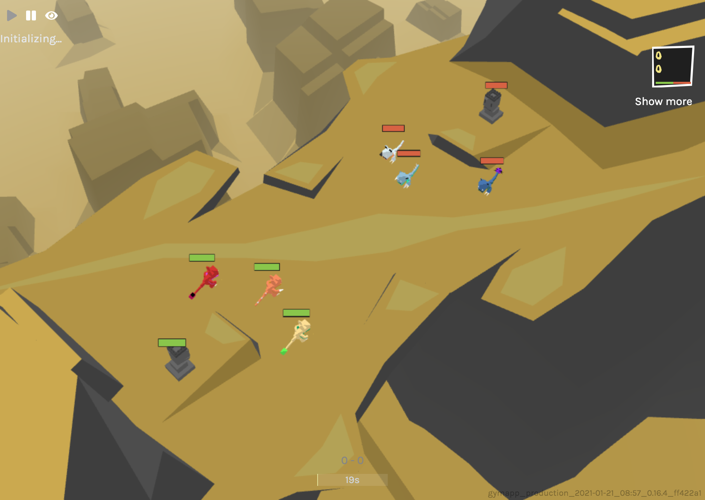

# Yet another starter kit for Dr. Derk's Mutant Battlegrounds Challenge



## Common information

 - 💪 Challenge Page: https://www.aicrowd.com/challenges/dr-derk-s-mutant-battlegrounds

- This solution is based on [Official starter kit](https://gitlab.aicrowd.com/dr-derk-s-mutant-battlegrounds/starter-kit). In official starter kit you can find submission instructions and other useful information, which I've decided to remove from this readme file (which was also copied from original starter kit).

- Current solution in repository's `main` branch is based on minimalistic implementation of [DQN algorithm](https://github.com/seungeunrho/minimalRL/blob/master/dqn.py), which was adapted to different environment conditions. Content from `snd_nn` branch was made by other team participant and it is work in progress.

- We've decided to publish the code we've made during last week as a team as an open solution, because we've worked on it during ods.ai community's [New Year 2021 Hackathon](https://ods.ai/competitions/pet_projects_2020) (the hackathon's page is in Russian, use google translate if necessary).

# 💻 Installation

List of required packages is provided in `requirements.txt` file. You can install them by the following command
```
pip install -r requirements.txt
```
or, in case of any problems, try to install them one by one via `pip`. I've checked everything with python 3.7 on Ubuntu and MacOS, haven't tested on Windows. The package named `python-telegram-bot` is included, but it's optional - I use it during training in `experiments/train_dqn_v1.py` script, and only if Telegram bot's token and channel name are provided in `.ENV` file.

For more information about challenge's gym environment, please refer to the [official documentation](http://docs.gym.derkgame.com/).

# Hidden environment variables and .ENV file

I use helper bash script `./runner.py` to update environment variables.
To use it, you'll need to add `.ENV` file to repository's root dir (don't add this file to version control - it might provide *secret* information, i.e., in my case Telegram token and channel name, which I've used to show bot fights to other hackathon's participants). To create it, run
```
touch .ENV
```
from root dir of this repository.

To add lines, open it in your favorite text editor (maybe Atom or nano. Or are you still at Vim?) In my case, I've added this (to ensure that imports of code inside project is visible from my scripts):
```
PYTHONPATH=$(pwd):$PYTHONPATH
```
and two lines, which were Telegram-specific (you can simply don't add them, script will work without them and without sending your data anywhere).
```
TELEGRAM_BOT_TOKEN="<my bot's secret token>"
TELEGRAM_CHANNEL="<my channel's name>"
```
You can add any variables related to services you use to this file.

# My solution - DQN-based

## Training

My training script was run like this:
```
./runner.sh python experiments/train_dqn_v1.py
```
You can check additional parameters by running it with `--help` flag.

The games played by agents guided by trained network were shown at [my telegram channel](https://t.me/experiment_runner9000), which I've created specifically for the ods.ai community new year 2021 hackathon. Not great, not terrible. At leaderboard it's more like terrible :) For now!

## Bot

Corresponding bot for DQN-based solution can be found at `agent/dqn_bot.py`. 
You may note several other files in that folder:

- `agent/random_bot.py` contains original bot from starter kit;
- `agent/simple bot.py` correspond to `experiments/train_v1.py` training script;
- `agent/bot.py` is still the main bot script, which is run during submission.
I use it as a placeholder to quickly change between bots and run any of them by changing text in 1 line.

# Run!

`python run.py` still works as it was in starter kit.

# 🚀 Submission Instructions

To submit to the challenge you'll need to ensure you've set up an appropriate repository structure, create a private git repository at https://gitlab.aicrowd.com with the contents of your submission, and push a git tag corresponding to the version of your repository you'd like to submit.

Detailed instructions can be found [here](https://www.aicrowd.com/challenges/dr-derks-mutant-battlegrounds/submissions/new).

## Repository Structure
We have created this sample submission repository which you can use as reference.

#### aicrowd.json
Each repository should have a aicrowd.json file with the following fields:

```
{
    "challenge_id" : "evaluations-api-drderk",
    "grader_id": "evaluations-api-drderk",
    "authors" : ["aicrowd-user"],
    "description" : "Dr. Derk Challenge Submission",
    "license" : "MIT",
    "gpu": false
}
```
This file is used to identify your submission as a part of the Dr. Derk Challenge.  You must use the `challenge_id` and `grader_id` specified above in the submission. The `gpu` key in the `aicrowd.json` lets your specify if your submission requires a GPU or not. In which case, a NVIDIA-K80 will be made available to your submission when evaluation the submission.

## Writing your own bot
You can start with the default bot.py or create your own agent that file. You can also your own script containing DerkPlayer class format present in bot.py.

**NOTE**: Only `bot.py` will be used during evaluation. Other bots can be used by you for running locally.

The functions that are required in the DerkPlayer class are:
* `__init__`: To initialize your player and will have the parameters `n_agents` and `action_space`
* `signal_env_reset`: To signal to your player that the environment has been reset and has the parameters `observation`
* `take_action`: This is the function where the observation will be passed and the actions for each agent are returned.

Please don't change the definition of these functions. You can add more if you want to.

# Running the Starter Kit
Run the python script:
```bash
python run.py -n 1
```

The python script has the following command line arguments: 
```console
usage: run.py [-h] [-p1 FILE_NAME_OF_PLAYER1] [-p2 FILE_NAME_OF_PLAYER2]
              [-n NUMBER_OF_ARENAS] [--fast]

optional arguments:
-h: to display help messages
-p1: The name of the file that contains player 1
-p2: The name of the file that contains player 2
-n: The number of arenas to run parallely (defaults to 2)
--fast: To enable turbo mode or not (cuts down episode time by half by speeding up animations)
```

For example, if you have `bot.py` and `oldbot.py` inside the `agent` directory, you can have a fight between them by running

```
python run.py -p1 bot -p2 oldbot
```
